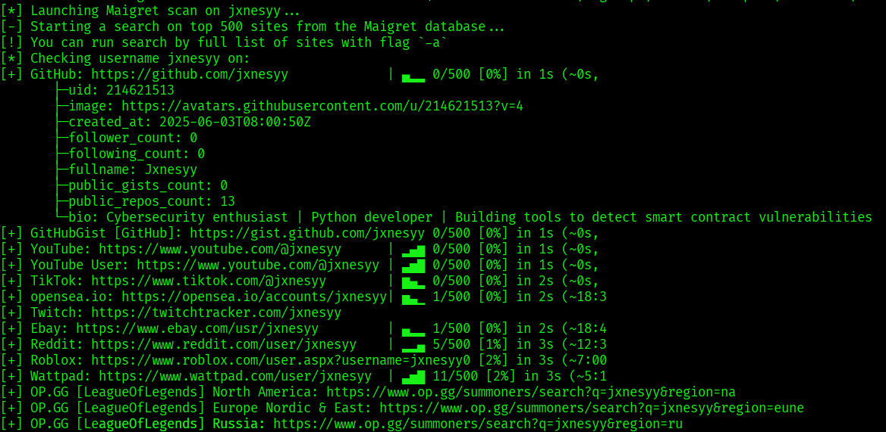

# 🛡️ 30 Days of Hacking – By Jxnesyy

A cyber warfare challenge blending OSINT, automation, and TikTok-ready scripts.

**30 tools. 30 days. Fully documented.**  
Built with Kali Linux, grit, and good intent.

---

## 🚀 Live GitHub Pages

👉 [**View the Interactive Guide**](https://jxnesyy.github.io/30DaysOfHacking/)  
👉 [**TikTok: @Jxnesyy**](https://tiktok.com/@jxnesyy)
=======
A cyber warfare challenge blending OSINT, automation, and TikTok-ready scripts.

30 tools. 30 days. Fully documented. Built with Kali Linux, grit, and good intent.

🚀 **Live GitHub Pages:** [View Interactive Guide](https://jxnesyy.github.io/30DaysOfHacking)
 d85dadf (🕸️ Day 4 Added: Webspider (wget) content to README)

---

## 📅 Daily Challenges

HEAD
| Day | Title                  | Tool / Script     | Description                                               |
|-----|------------------------|-------------------|-----------------------------------------------------------|
| 1   | Username OSINT         | `hunter.sh`       | Track a username across 300+ sites using Maigret          |
| 2   | Subdomain Enumeration  | `subhunt.sh`      | Discover hidden subs with Sublist3r and Subbrute          |
| 3   | Port Scanning          | `portscope.sh`    | Detect open ports and services with Nmap                  |

---

## 🖼️ Day 1 Demo (OSINT Username Hunt)


---

## ✅ Each Day Includes:
- Step-by-step CLI interaction
- 🎥 TikTok-ready recordings
- 🗂️ Reports auto-saved to `/reports/`
- 🌐 HTML-integrated landing page
=======
| Day | Title                 | Tool / Script     | Description                                              |
|-----|-----------------------|-------------------|----------------------------------------------------------|
| 1   | Username OSINT        | `hunter.sh`       | Track a username across 300+ sites using Maigret         |
| 2   | Subdomain Enumeration | `subhunt.sh`      | Discover hidden subdomains with Sublist3r + Subbrute     |
| 3   | Port Scanning         | `portscope.sh`    | Detect open ports and services using Nmap                |
| 4   | Website Spidering     | `webspider.sh`    | Mirror websites with wget spider mode                    |

Each day includes:
- ✅ Step-by-step CLI interaction
- 🎥 TikTok-ready recordings
- 🗂️ Organized reports saved to `/reports/`
- 🌐 HTML-based walkthroughs via GitHub Pages

---

## ✨ Day 1 Preview


d85dadf (🕸️ Day 4 Added: Webspider (wget) content to README)

---

## 🧠 Mission

This repo is for:
- 🧑‍💻 **Aspiring hackers** who want structured hands-on learning  
- 🎬 **Content creators** automating their cyber workflows  
- 🛠️ **Pentesters** building reusable, real-world tooling  

---

## ⚙️ Setup Instructions

### 1. Clone the repo

```bash
git clone https://github.com/Jxnesyy/30DaysOfHacking.git
cd 30DaysOfHacking

### 2. Make scripts executable
bash
chmod +x day0*/scripts/*.sh

### 3. Run any day's challenge
cd day01/scripts/
./hunter.sh

🧩 Dependencies
✅ Kali Linux (Rolling)

✅ Python 3.11+

✅ Tools: maigret, sublist3r, nmap, subbrute, tee

✅ Use virtualenv or install globally

🎬 TikTok Content Strategy
Each tool is designed for creators:

Minimal prompts

High-contrast terminal for capture

Auto-saving reports

Works with OBS + asciinema + svg-term-cli

🪪 License
MIT — use it, remix it, just credit it.

✨ Author
Built by @Jxnesyy
Cybersecurity Consultant · TikTok Creator · OSINT Hunter
=======
This repo is designed for:
- 🧑‍💻 Aspiring hackers who want structured practice
- 🎬 Content creators automating their process
- 🛠️ Pentesters building a real-world toolkit

## ⚙️ Setup Instructions

Clone the repo:
```bash
git clone https://github.com/Jxnesyy/30DaysOfHacking.git
cd 30DaysOfHacking
```

Make scripts executable:
```bash
chmod +x day0*/scripts/*.sh
```

Run a challenge:
```bash
cd day01/scripts
./hunter.sh
```

## 🧩 Dependencies
- Kali Linux (Rolling)
- Python 3.11+
- Tools: `maigret`, `sublist3r`, `nmap`, `subbrute`, `wget`, `tee`

## 🎬 TikTok Content Strategy
- Minimal prompt scripts
- High-contrast visuals
- Auto-saved outputs
- Built for OBS + asciinema + svg-term-cli

## 🪪 License
MIT – Use, remix, credit.

## ✍️ Author
Built by **Jxnesyy** — Cybersecurity Consultant, TikTok Creator, OSINT Hunter
d85dadf (🕸️ Day 4 Added: Webspider (wget) content to README)
