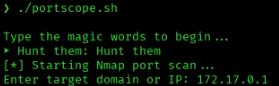
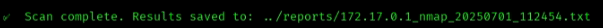
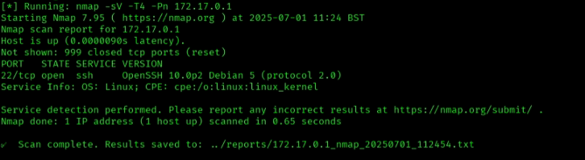

# 🔎 Day 3 – Port Scanning with Nmap

Today we’re using **Nmap** to discover open ports and services.

## 🧠 What You’ll Learn
- How to perform quick and deep port scans
- Detect common services on target hosts
- Save results to reports for later analysis

## ⚙️ Instructions

1. Open your terminal in Kali.
2. Navigate to the Day 3 script directory:
   ```bash
   cd day03/scripts
   ./portscope.sh

## 📦 Nmap Port Scan Preview

Here's how it looks when the scan runs:




