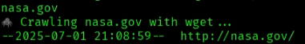
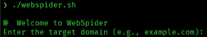
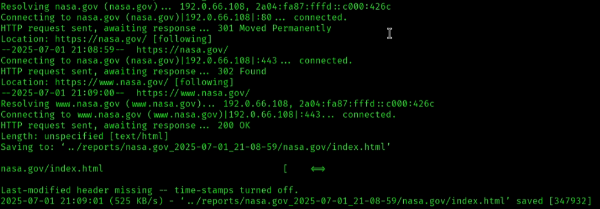
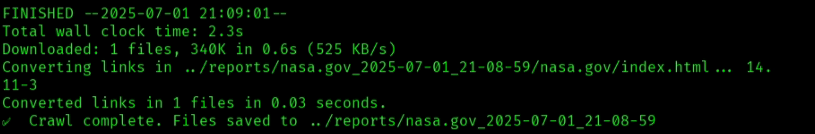

# 🕸 Day 4 – Web Spidering with wget

Today we’re using `wget` to recursively crawl and mirror websites — perfect for locating hidden paths, admin panels, and backup files.

---

## 🚀 What You’ll Learn

- How to use `wget` for recursive site crawling
- How to mirror an entire website structure
- Where to look for interesting content in downloaded data

---

## ⚙️ Instructions

1. Open your terminal in Kali.
2. Navigate to the Day 04 script directory:
   ```bash
   cd day04/scripts
   ./webspider.sh

3. When prompted, enter the target domain (e.g. example.com).

📂 Output will be saved in:
day04/web-mirror/

🧰 Tools Used
wget – recursive web spidering

bash – CLI script automation

🎯 Pro Tips
Pair this with grep to search downloaded files for juicy keywords (admin, login, backup).

Try combining this with dirsearch or ffuf in later challenges for full enumeration.

🎥 Built for TikTok + Terminal Capture
Perfect with OBS + svg-term-cli + high-contrast themes

🛡️ Ethical Use Only – Built for education and awareness.

## 🕸️ wget Spidering Demo

Live terminal screenshots of `webspider.sh`:





